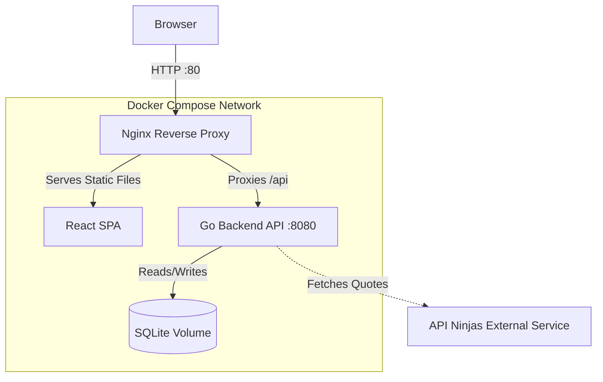

# Commit

**Precision Habit Tracking**

Commit is a high-performance, local-first habit tracker designed with a clinical, data-driven aesthetic. It features a developer-friendly terminal interface, quantitative tracking, and dynamic visual analytics.

## Features

- **GitHub-Style Contribution Graphs**: Visualize your progress over a rolling 52-week grid. Color intensity scales dynamically based on your quantitative check-ins.
- **Quantitative Tracking**: Track habits with custom units (e.g., "30 pages", "5 miles").
- **Retroactive Check-ins**: Log data for previous days if you forget.
- **Tagging & Filtering**: Organize your habits with custom tags and instantly filter your dashboard.
- **System Insights**: A built-in "terminal" interface that provides dynamic, conversational analysis of your recent progress.
- **Daily Quotes**: Pulls motivational quotes via API Ninjas, displayed as a slick terminal banner.

## Tech Stack

The application is fully containerized via Docker Compose, separating concerns into a lightweight architecture:



- **Frontend**: React, Vite, TypeScript, Tailwind CSS v4. Features a native SVG grid to avoid heavy charting libraries.
- **Backend**: Go (Golang) with `go-chi` router. Fast, stateless API.
- **Database**: SQLite. Ideal for local-first applications. Stored in a persistent Docker volume.
- **Proxy**: Nginx. Serves the static frontend and reverse-proxies `/api` requests to the Go backend.

## Prerequisites

- [Docker](https://docs.docker.com/get-docker/)
- [Docker Compose](https://docs.docker.com/compose/install/)

## Setup & Installation

1. **Clone the repository:**
   ```bash
   git clone <your-repo-url>
   cd commit_app
   ```

2. **Environment Variables:**
   Create a `.env` file in the root directory to enable the Daily Quotes feature.
   ```bash
   NINJAS_API_KEY=your_api_key_here
   ```
   *(You can get a free API key from [API Ninjas](https://api-ninjas.com/api/quotes))*

3. **Run the Application:**
   Start the services using Docker Compose:
   ```bash
   docker-compose up --build -d
   ```

4. **Access the App:**
   Open your browser and navigate to:
   ```
   http://localhost
   ```

## Development

- The **Go backend** is located in `/api`. It exposes endpoints on port `8080` internally.
- The **React frontend** is located in `/web`. You can run it locally using `npm run dev` (though you must ensure API requests proxy to port `8080`).
- Database files are stored persistently in the `/data` directory on your host machine.

## Testing

Commit maintains a high standard of quality with a minimum **70% test coverage** requirement for both frontend and backend.

### Backend (Go)
Navigate to the `api` directory and use the standard Go toolchain:
```bash
cd api
go test -cover ./...
```

### Frontend (React/TypeScript)
Navigate to the `web` directory and use the Vitest runner:
```bash
cd web
npm run test      # Run all tests once
npm run coverage  # Run tests and generate coverage report
```

## Design Philosophy

Commit uses a strict monochromatic, high-contrast color palette:
- **Background**: `#0B0E14`
- **Surface**: `#161B22`
- **Text Primary**: `#E6EDF3`
- **Accent Greens**: `#0E4429` (low) to `#39D353` (high)
- **Typography**: JetBrains Mono for a clean, data-driven layout. Emojis are strictly prohibited.
