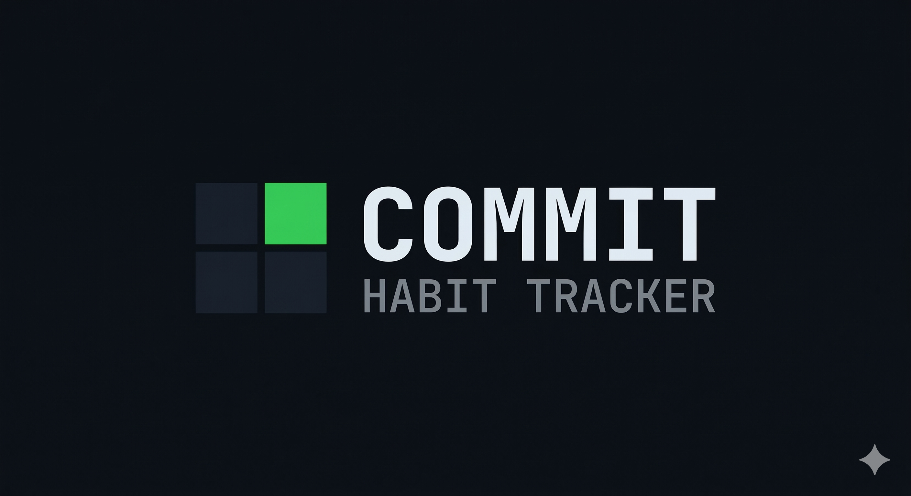
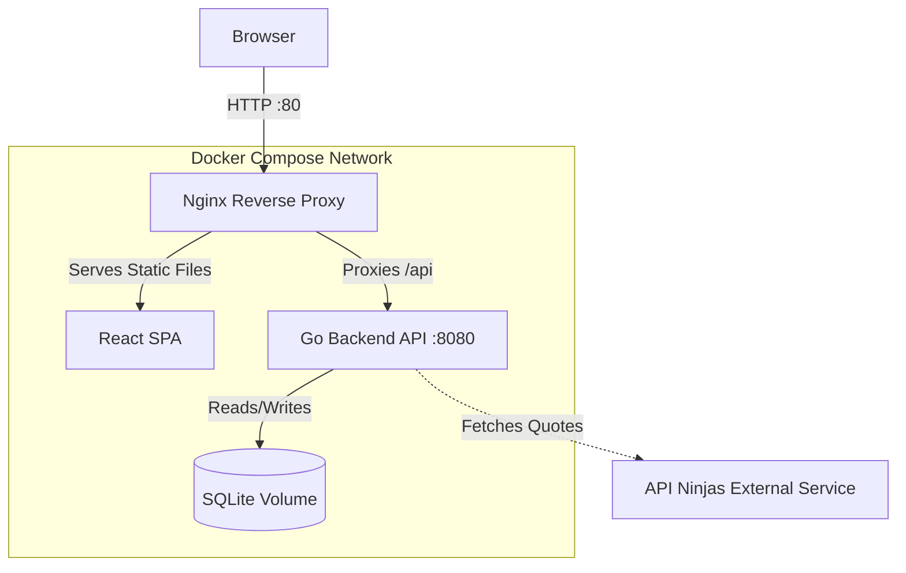

# Commit



**Precision Habit Tracking**

Commit is a high-performance, local-first habit tracker designed with a clinical, data-driven aesthetic. It features a developer-friendly terminal interface, quantitative tracking, and dynamic visual analytics.

## Features

- **GitHub-Style Contribution Graphs**: Visualize your progress over a rolling 52-week grid. Color intensity scales dynamically based on your quantitative check-ins.
- **Quantitative Tracking**: Track habits with custom units (e.g., "30 pages", "5 miles"). Check-in values of 0 are allowed.
- **Retroactive Check-ins**: Log data for previous days if you forget.
- **Tagging & Filtering**: Organize habits with custom tags. Filter chips show per-tag habit counts.
- **Streak Milestone Badges**: Automatic badges at 7, 30, and 100-day streaks.
- **Summary Row**: At-a-glance totals — active habit count and today's check-in progress.
- **Archive / Unarchive**: Soft-archive habits you want to pause. Archived habits are hidden by default and dimmed when shown.
- **System Insights**: A fixed-overlay "terminal" panel that provides dynamic, conversational analysis of your recent 30-day progress.
- **Daily Quotes**: Pulls motivational quotes via API Ninjas, rotating across 10 categories, displayed as a terminal banner.

## Tech Stack

The application is fully containerized via Docker Compose, separating concerns into a lightweight architecture:



- **Frontend**: React, Vite, TypeScript, Tailwind CSS v4. Features a native SVG grid to avoid heavy charting libraries.
- **Backend**: Go (Golang) with `go-chi` router. Fast, stateless API.
- **Database**: SQLite. Ideal for local-first applications. Stored in a persistent Docker volume.
- **Proxy**: Nginx. Serves the static frontend and reverse-proxies `/api` requests to the Go backend.

## Prerequisites

- [Docker](https://docs.docker.com/get-docker/)
- [Docker Compose](https://docs.docker.com/compose/install/)

## Setup & Installation

1. **Clone the repository:**
   ```bash
   git clone <your-repo-url>
   cd commit_app
   ```

2. **Environment Variables:**
   Create a `.env` file in the root directory to enable the Daily Quotes feature.
   ```bash
   NINJAS_API_KEY=your_api_key_here
   ```
   *(You can get a free API key from [API Ninjas](https://api-ninjas.com/api/quotes))*

3. **Run the Application:**
   ```bash
   make build
   ```

4. **Access the App:**
   Open your browser and navigate to:
   ```
   http://localhost
   ```

## Development

- The **Go backend** is located in `/api`. It exposes endpoints on port `8080` internally.
- The **React frontend** is located in `/web`. Run `npm run dev` inside `/web` for a fast local dev server — it proxies `/api` to port `8080`.
- Database files are stored persistently in the `/data` directory on your host machine.

> All build, test, and container operations should be run via `make`. See [CLAUDE.md](CLAUDE.md) for the full command reference.

## Testing

Commit maintains a minimum **70% test coverage** requirement for both frontend and backend.

```bash
make test-all       # Run backend + frontend tests
make test-backend   # Go tests with coverage (internal/service)
make test-frontend  # Vitest + React Testing Library with coverage
```

## Design Philosophy

Commit uses a strict monochromatic, high-contrast color palette:
- **Background**: `#0B0E14`
- **Surface**: `#161B22`
- **Text Primary**: `#E6EDF3`
- **Text Secondary**: `#7D8590`
- **Accent-1**: `#0E4429` — low-intensity grid cell
- **Accent-2**: `#006D32` — mid-low / 7-day streak badge
- **Accent-3**: `#26A641` — mid-high / 30-day streak badge
- **Accent-4**: `#39D353` — high-intensity / CTA green / 100-day streak badge
- **Typography**: JetBrains Mono throughout. Emojis are strictly prohibited.
